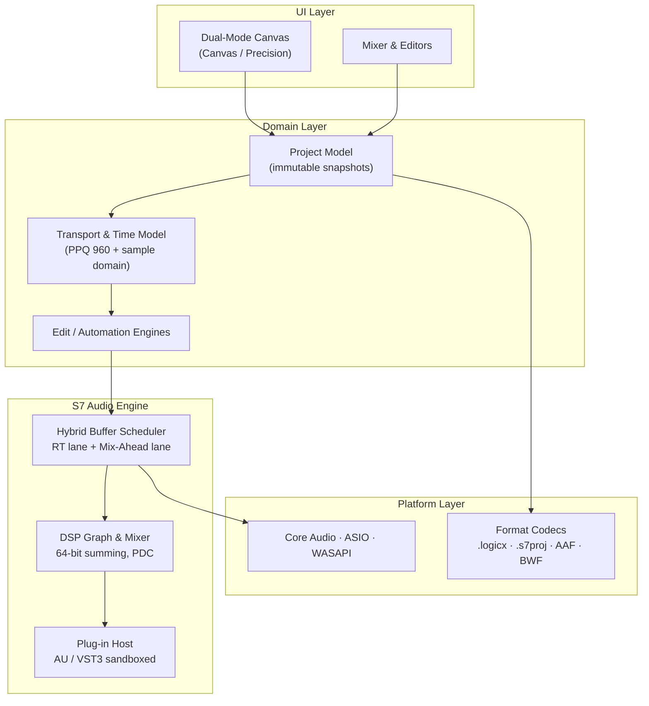

# seven7

[](../../actions/workflows/docs-build.yml) [](https://vitepress.dev) [](#documentation-site)

> **seven7** — a next-generation Digital Audio Workstation that bridges **Logic Pro's** creative, instrument-first workflow with **Pro Tools'** sample-accurate editing and industry-standard mixing precision.

This repository contains the **authoritative design blueprint** for seven7 (system architecture, UI/UX, mix engine, Logic Pro compatibility — written to implementation depth with requirement IDs and acceptance criteria) **and the first working milestone built on it**: a native desktop app with the full dual-mode shell.

## Quick start (macOS · Windows · Linux)

```bash
git clone https://github.com/mikeo-ne/seven7.git && cd seven7
cmake -B build-app -S app -G Ninja -DCMAKE_BUILD_TYPE=Release   # fetches JUCE 9.0.2, builds ui/ with npm, embeds it
cmake --build build-app --target seven7 -j
open build-app/seven7_artefacts/Release/seven7.app                 # macOS (Windows/Linux: run the seven7 binary)
```

Requirements: CMake ≥ 3.22, a C++20 compiler (Xcode 15+, MSVC 2022, GCC 12+), Node 20+. Linux additionally needs the JUCE GUI packages (see `.github/workflows/app-ci.yml`).

The app opens the demo project **"Midnight City"** on your default audio device. `⌃⌘M` toggles **Canvas** (Logic-style) ⇄ **Precision** (Pro Tools-style); Space/Enter/R/L/K/M/S transport & tools; `⌘E` split, `⌘D` duplicate, `⌘,` audio settings.

### What works in this milestone

| Area | Canvas | Precision |
|---|---|---|
| Frame | title · toolbar · LCD · status per docs/02 §1.2, three densities | same frame, PT edit/mix split (draggable 60:40) |
| Arrange | 260 px headers, region lanes, waveform peaks, MIDI thumbnails, fades, clip gain, markers, cycle | 360 px headers with I/O · inserts · sends · delay badge; edit-list column; nudge 1/10/100/1000 |
| Editing | Smart Tool zones, marquee, scissors, pencil, eraser, zoom; snap bar/beat/division/samples/sec/frames | edit modes Slip · Grid · Shuffle · Spot (Spot dialog) |
| Mixer | drawer mixer | docked strips: inserts A–E, sends 1–4, I/O, automation, pan, RSM, fader + meters (adaptive geometry) |
| Inspector | track/region/project + Smart Controls | same |
| Editors | Piano Roll · Step · Audio · Live Loops tabs | Piano Roll · Audio |
| Engine | play/loop/metronome, 6 built-in synth presets, live MIDI, **recording → regions with undo**, sample-accurate edits, undo/redo, `.s7proj` bundle save/open, WAV/BWF import | same |

## Development loop (no Xcode needed)

The UI can be developed in a browser against `s7bridge`, a tiny HTTP wrapper around the same Controller the desktop app uses:

```bash
cmake -B build -S engine -G Ninja && cmake --build build -j && ./build/s7bridge --port 8787   # engine + JSON protocol
cd ui && npm install && npm run dev                                                          # http://localhost:5174
cd ui && npm test && npm run test:engine                                                     # unit + integration (needs the bridge)
```

To hot-reload the UI **inside the native app**, configure with `-DS7_UI_DEV_SERVER=http://localhost:5174`.

The protocol shared by both paths is specified in [docs/07 · UI ↔ Engine Bridge Protocol](docs/07-ui-bridge-protocol.md).

## Documentation site

The blueprint ships as a **[VitePress](https://vitepress.dev) site** — the same Markdown that renders here on GitHub (Mermaid diagrams included) is built into a fast, searchable docs site and deployed to **Vercel**.

```bash
npm install          # one-time
npm run docs:dev     # local dev server with hot reload → http://localhost:5173
npm run docs:build   # static build → docs/.vitepress/dist
npm run docs:preview # serve the production build locally → http://localhost:4173
```

**Deploy to Vercel:** import this repository in [Vercel](https://vercel.com/new) — no settings required. [`vercel.json`](vercel.json) already declares the VitePress framework, build command (`npm run docs:build`), and output directory (`docs/.vitepress/dist`). Every push to the tracked branch produces a preview deployment; merges to `main` go to production. The [`Docs build`](.github/workflows/docs-build.yml) GitHub Action builds the same target on every push/PR so a broken site can never merge.

> **Custom domain:** in the Vercel project → *Settings → Domains*, add your domain and point DNS at Vercel. No code change needed — canonical URLs, Open Graph tags, and the sitemap resolve automatically from the Vercel environment (or set `S7_SITE_URL` to override).

## Engine

[`engine/`](engine) is the C++20 core (no framework dependencies): the sample-accuracy contract ([ARC-TIME](docs/01-system-architecture.md)), hybrid-buffer lane scheduler (ARC-ENG-01…03), cycle-safe routing + delay-compensation math (MIX-05/07), fader/pan/summing kernels, the project model + sample-accurate edit engine (EDT), an RT-safe session renderer with chunk-pool recording (ARC-RT-01…03), BWF + `.s7proj` codecs, and the `s7::app::Controller` that exposes everything as one JSON protocol — each with acceptance tests wired into CI:

```bash
cmake -B build -S engine && cmake --build build -j
ctest --test-dir build --output-on-failure   # 8 suites
./build/s7engine                              # headless render + PDC report + checksum
```

## Repository layout

```
app/      JUCE 9 desktop shell: audio device → engine, WebView hosting ui/, native menus/dialogs   → App CI
engine/   C++20 core: DSP graph, edit engine, RT session, codecs, Controller (JSON protocol), s7bridge → Engine CI
ui/       React + TypeScript (Vite) dual-mode UI, embedded into the app or served by Vite for dev      → App CI
docs/     Specification set (00–07) + VitePress site config                                            → Vercel
.github/  docs-build.yml · engine-ci.yml · app-ci.yml
```

---

## Design Documents

| # | Document | Scope |
|---|----------|-------|
| 00 | [Vision, Positioning & Scope](docs/00-vision-positioning-scope.md) | Product pillars, personas, competitive matrix, success metrics, v1.0 scope |
| 01 | [System Architecture](docs/01-system-architecture.md) | Layer/component breakdown, hybrid-buffer audio engine, threading & RT safety, project model, time model, performance budgets |
| 02 | [UI/UX & Main Window](docs/02-ui-ux-main-window.md) | Design language, Dual-Mode Canvas, full window-layout specs, wireframes, Smart Tool + tool matrix, keymaps, accessibility |
| 03 | [Mix Engine & Signal Flow](docs/03-mix-engine-signal-flow.md) | Channel-strip signal flow, routing/VMM, VCA & groups, delay compensation math, metering, immersive/Atmos, stock plug-in suite |
| 04 | [Editing, Sequencing & Automation](docs/04-editing-sequencing-automation.md) | Non-destructive edit model, sample-accurate ops, fades & clip gain, Flex Time/Pitch, playlists/comping, MIDI & Step Sequencer, Live Loops, dual-mode automation engine |
| 05 | [Logic Pro Compatibility](docs/05-logic-pro-compatibility.md) | `.logicx` codec strategy, object/preset mapping, Smart Controls & Track Stack import, opaque-chunk round-trip guarantee, conformance suite |
| 06 | [Glossary](docs/06-glossary.md) | Terminology used across the specs |
| 07 | [UI ↔ Engine Bridge Protocol](docs/07-ui-bridge-protocol.md) | The JSON command/state/status contract shared by the desktop host, browser dev preview and tests |

## Architecture at a Glance



## Contract Highlights

- **Sample accuracy everywhere.** All edits, automation breakpoints, fades, and clip-gain events resolve to the absolute sample timeline (ARC-TIME, EDT-01, AUT-02).
- **Two rooms, one project.** Toggle between a Logic-style creative canvas and a Pro Tools-style Edit/Mix precision workspace — same underlying project model, zero conversion (UIW-02).
- **Hybrid buffering.** Armed/monitored tracks run on the hardware buffer; parked playback tracks render ahead in large blocks, decoupling mix complexity from input latency (ARC-ENG-01).
- **Zero-loss Logic interchange.** `.logicx` import/export with verbatim retention of every chunk seven7 does not interpret (CMP-01, CMP-06).

## Status

Blueprint phase — specifications v0.9, draft for review. See each document's header block for status and requirement traceability.
