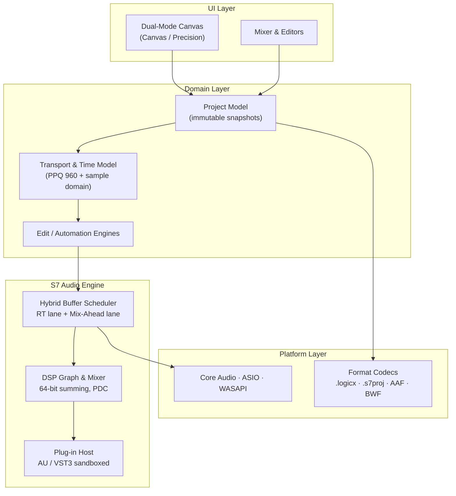

# seven7

[](../../actions/workflows/docs-build.yml) [](https://vitepress.dev) [](#documentation-site)

> **seven7** — a next-generation Digital Audio Workstation that bridges **Logic Pro's** creative, instrument-first workflow with **Pro Tools'** sample-accurate editing and industry-standard mixing precision.

This repository currently contains the **authoritative design blueprint** for seven7: system architecture, UI/UX specifications, mix-engine and signal-flow specifications, and the Logic Pro compatibility strategy. Documents are written to implementation depth (requirement IDs, acceptance criteria, numeric budgets) and are the single source of truth for engineering.

## Documentation site

The blueprint ships as a **[VitePress](https://vitepress.dev) site** — the same Markdown that renders here on GitHub (Mermaid diagrams included) is built into a fast, searchable docs site and deployed to **Vercel**.

```bash
npm install          # one-time
npm run docs:dev     # local dev server with hot reload → http://localhost:5173
npm run docs:build   # static build → docs/.vitepress/dist
npm run docs:preview # serve the production build locally → http://localhost:4173
```

**Deploy to Vercel:** import this repository in [Vercel](https://vercel.com/new) — no settings required. [`vercel.json`](vercel.json) already declares the VitePress framework, build command (`npm run docs:build`), and output directory (`docs/.vitepress/dist`). Every push to the tracked branch produces a preview deployment; merges to `main` go to production. The [`Docs build`](.github/workflows/docs-build.yml) GitHub Action builds the same target on every push/PR so a broken site can never merge.

> **Custom domain:** in the Vercel project → *Settings → Domains*, add your domain and point DNS at Vercel. No code change needed — canonical URLs, Open Graph tags, and the sitemap resolve automatically from the Vercel environment (or set `S7_SITE_URL` to override).

## Engine

[`engine/`](engine) contains the first C++20 vertical slice of the S7 Audio Engine: the sample-accuracy contract ([ARC-TIME](docs/01-system-architecture.md)), hybrid-buffer lane scheduler (ARC-ENG-01…03), cycle-safe routing + delay-compensation math (MIX-05/07), and fader/pan/summing kernels — each with acceptance tests wired into CI:

```bash
cmake -B build -S engine && cmake --build build -j
ctest --test-dir build --output-on-failure   # 4 suites, incl. 72k tick⇄sample identities
./build/s7engine                              # headless render + PDC report + checksum
```

## Repository layout

```
docs/     Specification set (00–06) + VitePress site config  → Vercel
engine/   C++20 engine skeleton (tested)                     → Engine CI
.github/  docs-build.yml (site CI) · engine-ci.yml (C++ CI)
```

---

## Design Documents

| # | Document | Scope |
|---|----------|-------|
| 00 | [Vision, Positioning & Scope](docs/00-vision-positioning-scope.md) | Product pillars, personas, competitive matrix, success metrics, v1.0 scope |
| 01 | [System Architecture](docs/01-system-architecture.md) | Layer/component breakdown, hybrid-buffer audio engine, threading & RT safety, project model, time model, performance budgets |
| 02 | [UI/UX & Main Window](docs/02-ui-ux-main-window.md) | Design language, Dual-Mode Canvas, full window-layout specs, wireframes, Smart Tool + tool matrix, keymaps, accessibility |
| 03 | [Mix Engine & Signal Flow](docs/03-mix-engine-signal-flow.md) | Channel-strip signal flow, routing/VMM, VCA & groups, delay compensation math, metering, immersive/Atmos, stock plug-in suite |
| 04 | [Editing, Sequencing & Automation](docs/04-editing-sequencing-automation.md) | Non-destructive edit model, sample-accurate ops, fades & clip gain, Flex Time/Pitch, playlists/comping, MIDI & Step Sequencer, Live Loops, dual-mode automation engine |
| 05 | [Logic Pro Compatibility](docs/05-logic-pro-compatibility.md) | `.logicx` codec strategy, object/preset mapping, Smart Controls & Track Stack import, opaque-chunk round-trip guarantee, conformance suite |
| 06 | [Glossary](docs/06-glossary.md) | Terminology used across the specs |

## Architecture at a Glance



## Contract Highlights

- **Sample accuracy everywhere.** All edits, automation breakpoints, fades, and clip-gain events resolve to the absolute sample timeline (ARC-TIME, EDT-01, AUT-02).
- **Two rooms, one project.** Toggle between a Logic-style creative canvas and a Pro Tools-style Edit/Mix precision workspace — same underlying project model, zero conversion (UIW-02).
- **Hybrid buffering.** Armed/monitored tracks run on the hardware buffer; parked playback tracks render ahead in large blocks, decoupling mix complexity from input latency (ARC-ENG-01).
- **Zero-loss Logic interchange.** `.logicx` import/export with verbatim retention of every chunk seven7 does not interpret (CMP-01, CMP-06).

## Status

Blueprint phase — specifications v0.9, draft for review. See each document's header block for status and requirement traceability.
