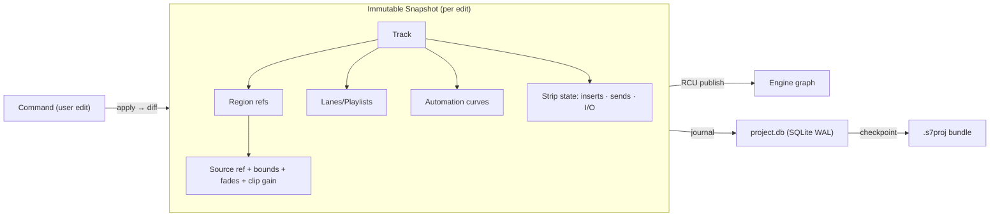

# S7-ARC · System Architecture & Component Breakdown

| | |
|---|---|
| **Status** | DRAFT FOR REVIEW |
| **Version** | 0.9 |
| **Date** | 2026-09-15 |
| **Owner** | Principal Audio SWE |
| **Fulfills** | Output Requirement 1 (Architecture), Input Requirements 1 (Core Processing Engine) |

---

## 1. Layered Architecture

```mermaid
flowchart TD
    subgraph L4["L4 — APPLICATION / UI"]
        UI1["Dual-Mode Canvas<br/>Canvas mode · Precision mode"]
        UI2["Mixer Window · Editors<br/>Piano Roll · Sample · Step · Smart Controls"]
        UI3["Command System<br/>keymap personalities · undo façade"]
    end
    subgraph L3["L3 — DOMAIN SERVICES"]
        D1["Project Model<br/>immutable snapshots (RCU)"]
        D2["Transport & Time Model<br/>PPQ-960 ⇄ sample dual timebase"]
        D3["Edit Engine<br/>regions · fades · playlists · Flex"]
        D4["Automation Engine<br/>region + track modes"]
        D5["Selection & Clipboard<br/>sample-domain ranges"]
        D6["Session Services<br/>groups · VCAs · memories · windows"]
    end
    subgraph L2["L2 — S7 AUDIO ENGINE"]
        E1["Hybrid Buffer Scheduler<br/>RT lane + Mix-Ahead lane (MAE)"]
        E2["DSP Graph<br/>pull-based · per-stem parallel"]
        E3["Mixer Core<br/>64-bit sum · pans · VCAs · PDC engine"]
        E4["Plug-in Host (in-proc ABI)"]
        E5["Render / Bounce · Freeze cache"]
    end
    subgraph L1["L1 — PLATFORM (PAL)"]
        P1["Audio HAL<br/>CoreAudio · ASIO · WASAPI-excl"]
        P2["MIDI HAL<br/>CoreMIDI · WinMM/WS"]
        P3["Disk Streaming<br/>ring buffers · peak cache"]
        P4["Plug-in Sandboxes<br/>S7 Plugin Server processes"]
        P5["Format Codecs<br/>.s7proj · .logicx · AAF · BWF/RF64 · CAF"]
        P6["OS services<br/>threads · IPC · files · GPU"]
    end
    L4 --> L3 --> L2 --> L1
```



**Rule:** dependencies point down only. The engine never links UI; the domain layer never touches HAL; formats are isolated behind codec interfaces so `.logicx` support is a plugin, not a patch (see CMP-ARC).

---

## 2. Technology Stack

| ID | Decision | Choice / Rationale |
|---|---|---|
| ARC-T01 | Engine & domain language | **C++20** (no exceptions/RTTI on RT paths; `pmr` arenas for RT-adjacent structures) |
| ARC-T02 | UI framework | Custom **S7 UI Kit** (retained-mode, Metal/Vulkan-backed) over a thin JUCE 8 scaffold for windowing/MIDI glue; guarantees 120 Hz ProMotion rendering and full control of text/waveform rasterization |
| ARC-T03 | Internal signal format | 32-bit float channel data; **64-bit double accumulation at every summing junction**; interleave only at HAL boundary |
| ARC-T04 | Concurrency | Lock-free SPSC/MPSC rings, RCU snapshot publication, work-stealing pool (N_cores − 1); `seq_cst` prohibited in audio paths |
| ARC-T05 | Persistence | `.s7proj` bundle = `project.db` (SQLite, WAL) + `manifest.json` + `Media/`, `Analysis/`, `History/`; never a monolithic memory image |
| ARC-T06 | Build/config | CMake + preset matrix (macOS universal, Win64); deterministic builds; engine also shipped headless (`s7engine`) for CI conformance runs |

---

## 3. Component Breakdown

| Comp ID | Component | Responsibility | Thread affinity | Failure domain |
|---|---|---|---|---|
| ARC-C01 | **Audio Callback** (PAL) | Pull one hardware block of I/O; drive RT lane | RT (HAL thread, elevated) | Per-block underrun ⇒ log + insert silence, never crash |
| ARC-C02 | **Hybrid Buffer Scheduler** | Classify tracks RT ↔ MAE; stitch lanes; manage arm/disarm transitions | RT + control | Misclassification ⇒ transient 10 ms crossfade, no artifacts |
| ARC-C03 | **DSP Graph Executor** | Topologically schedule nodes; parallel per stem; emit automation at sample offsets | Pool | Node exception impossible (no-except ABI); watchdog ⇒ node bypass |
| ARC-C04 | **Mixer Core** | Gain/pan/sum, sends, VCAs, masters, metering taps | Pool (via C03) | PDC mismatch ⇒ flagged readout, audio stays correct |
| ARC-C05 | **Plug-in Host ABI** | Versioned C ABI to AU/VST3 adapters; event + latency ports | Pool | Isolated: faults contained by C14 |
| ARC-C06 | **Transport** | Play/record state machine, locators, punch, chase, varispeed | Control (publishes to RT) | State conflict ⇒ last-good snapshot retained |
| ARC-C07 | **Time Model** | Tempo/meter maps; tick⇄sample rational conversion; timecode families | Any (pure functions) | Unit-test fenced (ARC-TIME) |
| ARC-C08 | **Edit Engine** | Non-destructive ops over regions/fades/playlists; emits graph diffs | UI/worker | Command failure = no-op + undo intact |
| ARC-C09 | **Automation Engine** | Dual-mode storage, evaluation, thinning, write modes | Worker + RT eval | Eval falls back to last value |
| ARC-C10 | **Project Model Store** | Immutable snapshot graph; SQLite persistence; schema migrations | Worker | Corrupt DB ⇒ WAL replay; autosave journal |
| ARC-C11 | **Disk Streamer** | Per-file 256 KB rings; read-ahead; format readers (BWF/RF64/CAF/AIFF/FLAC/mp3-AAC decode) | I/O pool | Starvation ⇒ track-level dropout indicator |
| ARC-C12 | **Peak/Analysis Cache** | Waveform mipmaps, transients (Flex), loudness scans | Background | Stale ⇒ recomputed lazily; never blocks UI |
| ARC-C13 | **Codec: Logic Package** | `.logicx` parse/emit, chunk registry, opaque retention | Worker | See CMP-01…08 (isolated, fuzzable) |
| ARC-C14 | **S7 Plugin Server** | Out-of-process AU/VST3 execution; shared-mem audio rings; heartbeat | Child procs | Crash ⇒ strip slot inactive + session autosave, host survives |

---

## 4. The Core Processing Engine — Hybrid Buffer Architecture

> Requirement source: *"Sample-accurate audio editing engine with hybrid buffer architecture (low latency for active tracks, higher buffer for background playback/mixing)."*

### 4.1 Concept

Classic DAWs force one trade-off: the whole graph runs at the hardware block size, so a 400-track mix at 32 samples destroys CPU efficiency. seven7 splits the session into **two processing lanes** that are latency-aligned at the mix bus:

| Lane | Tracks | Block size | Purpose |
|---|---|---|---|
| **RT lane** | Record-armed, input-monitored, live-played software instruments, and anything in their upstream dependency cone | = hardware buffer (32–512 spl) | Minimum possible monitoring latency |
| **MAE lane** (Mix-Ahead Engine) | All *parked* playback tracks (recorded audio, non-armed instruments), buses, masters | 4096 spl internal block, scheduled `L_ahead` of DAC time | Efficient batch processing; latency of long plug-in chains absorbed by look-ahead |

```text
                 DAC time ──────────────────────────────────────────►
   wall clock ────┬───────────────┬───────────────┬───────────────
   HW block n     │  64 spl       │
                  ▼
   RT lane   [armed gtr in → amp sim → bus]        latency ≈ 2 × HW
   MAE lane  [===== 4096 spl block k =====][===== block k+1 =====]  rendered L_ahead ahead
                  │                  ▲ crossfade-stitched & latency-aligned into bus
   stitch buffer ─┴──────────────────┴──► bus Σ (PDC-aligned domains) ─► DAC
```

- **L_ahead** = `max(4096, 2 × HW buffer) + max(0, max_background_chain_latency − PDC_cap)`; default ≈ 96 ms @ 48 kHz / 64 spl.
- The MAE lane renders the *entire parked mix* block-by-block; because it runs ahead, even a 10 ms-latency linear-phase EQ on a background track costs nothing at the monitoring path.
- Automation for MAE tracks is offset by `-L_ahead` so breakpoint → audible effect alignment stays sample-accurate (AUT-02).

### 4.2 Lane transitions (ARC-ENG-03)

Record-arm (or input-monitor) toggling reclassifies a track. To stay click-free and *sample-aligned*:

1. Freeze the track's position in both lanes; ramp MAE contribution out and RT contribution in over a **10 ms equal-power crossfade** in the stitch buffer.
2. Recompute PDC for both domains; armed-path latency **never exceeds** `HW_in + HW_out + engine(≈32 spl)` regardless of what the parked mix is doing.
3. If **Low Latency Mode** is on, RT-lane plug-ins reporting latency > threshold (user-set, default 10 ms) are auto-bypassed with a visual badge (Low Latency Mode — see 03 §4.1).

### 4.3 DSP graph execution

- Pull-based: each hardware block, the master output requests its inputs; the executor topologically sorts the dirty subgraph once per control change and caches the schedule.
- Parallelism is **stem-partitioned**: independent track+insert chains are `super-nodes` scheduled across the pool; converging buses synchronize with join barriers. Speedup target: ≥ 3.4× on 4 P-cores for a flat 64-track session.
- SIMD: all channel ops (gain, sum, pan, meter) have AVX2 / NEON kernels; plug-ins run as-is between kernels.
- Denormal policy: FTZ/DAZ set on every audio thread plus per-node DC-blocking bias; no underrun may originate from denormals.

### 4.4 Real-time safety rules (enforced by test + audit)

| ID | Rule |
|---|---|
| ARC-RT-01 | No heap allocation, `malloc`, file I/O, logging I/O, or thread blocking on the RT lane. Violations caught by interposed allocator in CI. |
| ARC-RT-02 | Graph edits (add/remove node, reroute) are built offline and **swapped via RCU**; the RT lane only ever dereferences a consistent schedule. |
| ARC-RT-03 | Parameter changes reach the engine as timestamped events in a lock-free ring—never by writing plug-in state directly. |
| ARC-RT-04 | Undo/redo, project load, plug-in instantiation are *control-plane* operations; the audio keeps playing from the last good snapshot. |

---

## 5. Time Model (ARC-TIME) — the sample-accuracy contract

| Aspect | Specification |
|---|---|
| Musical grid | 960 PPQ, 64-bit signed tick domain (`±1.5 × 10⁹` years at 120 BPM) |
| Absolute grid | 64-bit sample positions relative to session t₀; supports 24 h timelines @ 384 kHz |
| Tempo map | Piecewise segments of constant tempo; each segment carries `(start_tick, start_sample, bpm)` — conversions are **integer rational accumulation**, never iterative floats, so conversion is exactly invertible and drift-free |
| Rounding rule | Musical→sample conversion rounds to `nearest-even` sample; **every edit, region bound, fade, and automation point stores its sample position as the source of truth** and re-derives ticks on tempo edits |
| Pull | Varispeed implemented as a resampling map over the sample timeline; pitch/overtone behavior defined in EDT-07 |
| Timecode | 23.976/24/25/29.97 DF+NDF/30 fps; sample↔TC tables generated per segment; MTC/LTC chase within ±1 sample after lock |

**Acceptance (ARC-TIME-A1):** property test — for random tempo maps (≤ 400 segments) and random ticks, `tick→sample→tick` round-trips are identity or the documented ±0-tick nearest-even case, over ≥ 10⁸ cases.

---

## 6. Project Model & Persistence (ARC-MDL)



- **Immutable snapshots + structural sharing**: every undoable edit produces a new snapshot; unchanged subtrees are shared. Cheap undo = pointer swap (ARC-RT-04 satisfied by construction).
- **Bundle layout** (`.s7proj`):
  ```text
  Midnight City.s7proj/
  ├── manifest.json           # app version, schema rev, feature flags
  ├── project.db              # SQLite: model tables, history, window states
  ├── Alternatives/000/…      # Logic-style alternatives (arrangement snapshots)
  ├── Media/Audio Files/      # consolidated or referenced (per-save option)
  ├── Analysis/               # .s7pk peaks, transient maps, loudness scans
  ├── Freeze/                 # freeze/stem render caches
  ├── History/                # autosave ring (10 gens, 30 s cadence)
  └── Plug-in States/         # binary blobs keyed by slot UUID (opaque)
  ```
- **Autosave/crash**: WAL + history ring means a power loss costs ≤ 30 s of work; plug-in server crashes (C14) never corrupt the model.
- **Schema migrations**: forward-migrating readers; every save writes `schema_rev`; CI round-trips all historical revs.

---

## 7. Plug-in Hosting (ARC-PGN)

| Aspect | Specification |
|---|---|
| Formats | **AUv2/AUv3** (macOS), **VST3** (macOS/Win), S7 native ABI for the stock suite. CLAP: v1.1 candidate |
| Sandboxing | Every plug-in runs **out-of-process** in *S7 Plugin Server* instances (grouped per vendor by default; per-instance option). Audio/MIDI via shared-memory rings; parameter events via the same ABI as in-proc (zero-copy structural code sharing). A crashed server takes down only its plug-ins (slots shown *inactive*, session autosaved) |
| Latency | Mandatory `get_latency_samples` at instantiate and on change; values feed the PDC engine (MIX-07) |
| Events | Sample-accurate parameter events (offset-in-block), MIDI in/out incl. MIDI-FX chains (MID-05), sidechain audio ports, MPE channel data |
| GUI | Out-of-process windows re-parented into S7 frames; HiDPI scaling; per-plug-in sandbox keyboard focus rules |
| Presets | Unified preset DB (`.aupreset`, `.vstpreset`, S7 native) with tagging; used by the Logic importer (CMP-05) |

---

## 8. Performance Budgets (reference hardware: M3 Pro / Ryzen 9 7900, 48 kHz)

| ID | Budget | Limit |
|---|---|---|
| ARC-P01 | RT lane per block (64 spl) | ≤ 1.0 ms (75% of the 1.33 ms period) |
| ARC-P02 | MAE lane per 4096-spl block | ≤ 20 ms wall, all cores |
| ARC-P03 | Session ceiling | 1024 audio / 1024 instrument tracks, 512 aux, 256 buses, 64 VCAs, 12-wide channels (7.1.4) |
| ARC-P04 | Cold launch to audio-ready | ≤ 2.5 s (empty), ≤ 8 s (500-track golden project, warm cache) |
| ARC-P05 | UI frame rate | ≥ 90 fps scroll/zoom @ 1440p; waveform draw never blocks > 2 ms |
| ARC-P06 | Disk streaming | 256 concurrent streams @ 256 KB rings from SATA SSD |

---

## 9. Headless & Test Architecture

`s7engine` runs without UI for: Logic round-trip CI (CMP-08), offline bounces diffed bit-exactly, AFL-style fuzzing of all codecs (C13, C11 readers), and ARC-TIME property tests. Every nightly build publishes: conformance %, bit-exact bounce hashes, and RT-budget traces — the engine is *measured*, not assumed.

---

## 10. Requirements Index (this document)

| ID | Requirement | Acceptance |
|---|---|---|
| ARC-ENG-01 | Hybrid buffer: RT lane at HW size; MAE at ≥ 4096 spl | Visual + DSP test of lane assignment; ARC-P01/P02 hold |
| ARC-ENG-02 | Sample accuracy applies to edits, fades, clip gain, automation | ARC-TIME-A1 property tests; bounce diff bit-exact vs. reference render |
| ARC-ENG-03 | Click-free lane transitions ≤ 10 ms, alignment preserved | Click detector: no transient > −60 dBFS above program content |
| ARC-RT-01…04 | RT safety rules | CI interposer + stress suite, 0 violations |
| ARC-PGN-01 | Sandboxed AU/VST3 hosting with latency/event fidelity | Crash-injection test: host survives 100 forced plug-in faults |
| ARC-MDL-01 | Immutable model, WAL autosave, ≤ 30 s loss | Power-cut fuzz × 1,000 runs, 0 corrupt projects |
