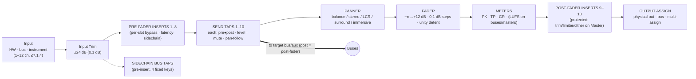

# S7-MIX · Signal Flow & Mix Engine Specifications

| | |
|---|---|
| **Status** | DRAFT FOR REVIEW |
| **Version** | 0.9 |
| **Date** | 2026-09-15 |
| **Owner** | Principal Audio SWE |
| **Fulfills** | Output Requirement 3 (Signal Flow & Mix Engine), Input Requirements 2 (Mix Window & Routing) |

---

## 1. Channel Strip Signal Flow

Every audio-bearing strip — Audio, Instrument, Aux, Bus-Master, Master — runs the following fixed chain (MIX-01). The topology is identical across lanes; only input stage differs (disk stream / instrument / bus tap).



**Design rules**
1. **Inserts are always pre-fader** (slots 1–8) except the two protected post-fader slots (9–10) — this is the Logic-compatible default *and* PT-parity explicit; no hidden "output insert".
2. **Sends are individually pre/post/pan-follow** and can target: any bus, an aux input directly, or a hardware out. Cycle detection runs on every route commit (MIX-05).
3. **Fader taper:** 0 dB unity at 75% travel; +12 dB top; dB-linear to −60, then accelerated to −144, mute below (MIX-03).
4. What Logic calls "channel strip settings" (`.cst`) maps exactly onto this chain — inserts 1–8 ⇄ Logic slots; sends ⇄ sends; post slots reserved for S7-only extensions, exported to Logic as inactive (CMP-04).
5. All gain stages are 32-bit float; **bus summing accumulates in 64-bit double**, single-rounded at the bus output. Effective headroom is non-clipping internally; only physical outs/exports clip at 0 dBFS.

## 2. Track & Strip Taxonomy (MIX-02)

| Type | Audio? | Role | Notable behavior |
|---|---|---|---|
| Audio | ✓ | disk/instrument of regions | lane: RT when armed, MAE when parked (ARC-ENG-01) |
| Software Instrument | ✓ | MIDI in, instrument slot + inserts | armed = RT lane; MPE native |
| Aux | ✓ | send destination, sub-mix, FX return | input = bus(es) or HW |
| Bus-Master | ✓ | explicit sub-group master | created automatically when a bus is "shown"; folder/summing-stack target |
| VCA Master | ✗ | control-only | moves member faders by dB offset (MIX-09); no audio, no inserts, no sends |
| Folder Stack | ✗ (structural) | Logic Folder Stack import | collapses tracks; groups selection |
| Summing Stack | ✓ | Logic Summing Stack import | = Folder + Aux sub-mix auto-route (CMP-04) |
| Master | ✓ | final out, dither slot | red fader; dither/export interplay (MIX-13) |

**Ceilings (MIX-02A):** 1024 audio, 1024 instrument, 512 aux, 256 buses (each 1–12 ch), 64 VCAs, 10 sends/strip, 10 inserts/strip, 16 physical-out assign targets/strip.

## 3. Virtual Mix Matrix (routing model) (MIX-04/05)

Routing is a **named-bus matrix**, Pro Tools-style, rendered two ways:

- **I/O selectors on every strip** (input / output / 10 sends), and
- a dockable **Routing Matrix view** (rows = sources, columns = destinations, crosspoint = click to assign, ⌥-click = assign exclusive).

Rules enforced at commit time (never mid-buffer, per ARC-RT-02):
1. Buses are first-class named objects (`B01…B256`, user-named, width-tagged); a bus exists as audio memory only when ≥1 listener references it — zero-cost unused routing.
2. Any output or send may feed **multiple** destinations (multi-assign); meters tap post-fader per destination when metering that path.
3. **Cycle detection** across sends/outputs/stem-ins, including control-only paths (no VCA cycles). Rejected routes flash the offending crosspoint; nothing partial is committed.
4. Delay compensation operates per *domain* (see §4); routing changes re-derive the domain graph and re-publish via RCU.
5. **Stem-in:** any strip input may also tap a bus *post-source-fade*, enabling PT-style "print your own subgroup back to a track" record workflows without patching.

## 4. Delay Compensation Engine (MIX-07)

> Requirement: *"delay compensation readouts"* — seven7 doesn't just compensate; it **shows the numbers on every strip**.

### 4.1 Model

Each node *n* reports `L(n)` (plug-in latency, resamplers, HW insert latency). For each strip *s*:

```
L_strip(s) = Σ L(inserts 1–10)  +  L(input resample)  +  L(HW insert loop, if any)
```

For each summing junction *j* (bus or master) with upstream paths `P ∈ reaching(j)`:

```
L_path(P) = Σ over strips/nodes strictly upstream of j along P
D(j)      = max_P { L_path(P) }                     (domain delay)
insert delay line on each path:  L_path(P) += D(j) − L_path(P)   ⇒  all paths arrive aligned
```

- Compensation is computed **per junction**, but seven7 collapses to *domains*: all paths that converge are aligned to the domain max; independent subtrees are not penalized (PT long-delay domains semantics).
- **ADC cap** (user pref, default 32 768 spl with per-track limit 8192): paths exceeding the cap are compensated only up to the cap; the offending strip's readout turns **red** and lists the responsible plug-ins.
- The MAE lane absorbs background-track latencies up to `L_ahead` *before* spending the ADC cap (ARC-ENG-01); RT-lane strips live in the Low-Latency domain (only HW+engine latency, LLM bypass list honored).
- Reported values are true samples and **exact**: readouts `0/512/1152 smp`, not "—".

### 4.2 Readout UX (UI contract)

| State | Color | Trigger |
|---|---|---|
| `● green` | — | `L_strip < 2048` or fully compensated |
| `● amber` | — | `2048 ≤ L_strip ≤ 8192` (fully compensated; noteworthy) |
| `● red` | — | beyond per-track cap: *partially* compensated, click = offender list + "make inactive" offered |

Status bar shows global: `PDC ON · cap 32768 · worst 1152 smp`. One click opens the compensation report (sortable table: strip, path latency, inserted delay, bypass suggestion).

## 5. Sends discipline (MIX-06)

- 10 sends per strip; each: **destination** (bus/aux/HW), **level** (−∞…+12), **pre/post**, **mute**, **pan mode** (follow strip pan / independent / FMP "follow main pan"), **link-to-fader**.
- *Pre* send taps post-inserts, pre-fader (PT convention); *post* taps post-fader, pre-post-inserts.
- Send view modes in the Routing Matrix: *assignments / levels / mutes*; `⌥`-drag copies a whole send row across strips (Logic "copy channel strip setting" parity).

## 6. VCA & Groups (MIX-09)

| Behavior | Specification |
|---|---|
| VCA action | VCA fader applies dB offset to members; **affects post-fader sends of members, leaves pre-fader sends untouched** (PT semantics — required for stem/ orchestrator workflows) |
| Nesting | VCAs may control VCAs; effective offset = Σ dB along chain (cycle-rejected) |
| Spill | VCA "spill" button (and surface command) isolates member strips in the mixer; auto-layout by bank |
| Groups | 96 mix/edit groups (4 banks × a–x); attribute matrix: Selection/Edit-follow · Volume · Pan · Mute · Solo · Sends(level/mute) · RecordEnable · InputMon · AutomationMode. Group window = PT layout; suspend-all `⇧⌘G` |
| Coalescing | Grouped fader moves write a *single* undo step and remain linked inside automation write passes (AUT-05) |

## 7. Panning & Immersive (MIX-10/11)

**Panners** (per strip, by channel width): mono→stereo balance · dual-mono · stereo (L/R pair) · LCR · quad · 5.1/7.1 surround puck (angle, divergence 0–100%, LFE send level) · **immersive XYZ puck** (X/Y/Z + divergence-per-axis + size/spread, 7.1.4).

**Pan law** (project pref): −2.5 / **−3.0 (default, constant-power sin/cos)** / −4.5 / −6.0 dB center; surround divergence follows ITU-R BS.775 geometry with per-speaker trim.

**Immersive / Atmos (v1 scope)**
- Bed bus: 7.1.2 (10 ch); object buses: up to 118; monitor path 7.1.4.
- Render targets: external Dolby Renderer (130 ch over core audio/ASIO), Apple binaural spatialization, or S7 internal binaural (SOFA/BRIR, head-tracking off at 1.0).
- Object metadata rides automation lanes (sample-accurate XYZ) and exports in the ADM/BWF master (MIX-11A). Beds/objects route via the same matrix (§3) — immersive is *routing widths*, not a separate app mode.
- Fold-down defaults (LoRo, coefficients in dB): C −3.0, Ls/Rs −3.0 (option −6.0), LFE excluded at −10…off, rears-to-front phase-managed; user-editable matrix per project.

## 8. Metering (MIX-08)

| Meter | Ballistics / standard | Where |
|---|---|---|
| Sample-peak | sample-accurate, hold 3 s or ∞ (pref) | every strip |
| True-peak | BS.1770 4× oversampled inter-sample | buses/masters, optional strips |
| PPM | IEC 60268-10 Type I / IIa selectable | strip meter bridge option |
| K-20/K-14/K-12 | Bob Katz scale refs | master & control-room strip |
| LUFS M/S/I | BS.1770-4 gating | buses, masters, loudness panel |
| Phase correlation | −1…+1, 300 ms window | master, any stereo bus |
| GR meter | per-comp/limiter, −12 dB range, 20 Hz | strips (mini, above fader) |

Clip LEDs latch until clicked; overs are counted and logged to the session report (bounce QA, MIX-13).

## 9. Monitor / Control-Room path (MIX-14)

- Dedicated **Monitor strip** outside the mixed graph: source select (mix bus / ext refs A–D), dim −20, mono fold, talkback with auto-dim, speaker A/B/C sets with per-set trim & delay, cue mixes ×8 (from send taps).
- Because it lives *after* the master, reference switching never touches the mix graph or its PDC domain — print and monitor paths are separate by construction.

## 10. Stock Plug-in Suite (MIX-12) — parity map

S7 ships a native stock suite engineered to cover Logic Pro's production defaults so imported projects sound the same without third-party installs (fidelity targets noted; all S7-native, zero-latency where marked ✱):

| Category | S7 plug-in | Logic counterpart it covers |
|---|---|---|
| EQ | **S7 EQ-8** ✱ (8-band, dynamic per band, linear-phase option) | Channel EQ, Linear Phase EQ |
| Dynamics | **S7 Comp** ✱ (VCA/FET/Opto/Digital/Studio models, sidechain, mix, auto-gain) | Compressor (all circuits) |
| Gate/Exp | **S7 Gate** ✱ (hysteresis, sidechain filters, look-ahead) | Noise Gate, Expander |
| Limiter | **S7 Limiter** (true-peak, 4 shapes, GR meter) | Limiter, Adaptive Limiter |
| Reverb | **S7 RoomWorks** (conv., IR library + trim/predelay/EQ) / **S7 HaloVerb** (algorithmic, chroma-band controls) | Space Designer / ChromaVerb |
| Delay | **S7 Echo** (tape, stereo, pattern, diffusion, ducking) | Tape Delay, Stereo Delay, Delay Designer |
| Modulation | **S7 Mod FX** (chorus/flanger/phaser/tremolo/rotary micro-rotor) | Chorus, Flanger, Phaser, Tremolo, Rotor Cabinet |
| Distortion | **S7 Drive** (amp+pedal stages, cabinet IR / "Amp Room"), **S7 TapeSat** ✱ | Amp Designer, Pedalboard, Tape/Overdrive/Distortion |
| Pitch/Time | **S7 PitchShifter**, Flex engine internal (EDT-06/07) | Pitch Shifter, Vocal Transformer |
| Utility | **S7 Utility** ✱ (gain/phase/mono/width/dc/dither TPDF) | Gain, Multimeter → **S7 Meter** (§8 all meters native) |
| Filter | **S7 Filter-6** ✱ (analog models, drive, FM) | AutoFilter |
| Instruments | **S7 Sampler** (reads EXS24, CMP-05c), **S7 Prism7** (wavetable), **S7 Sub-An** (analog mono), **S7 DrumKit** (ACID-kit + pads) | Sampler/QuickSampler, Alchemy-class, ES2-class, Drum Kit Designer/Drum Machine Designer |
| MIDI FX | see MID-05 (8 devices) | Logic MIDI FX suite |

**Acceptance (MIX-12A):** for each Logic stock plug-in appearing in the golden-project corpus (CMP-08), either (a) the original AU loads, or (b) an S7 plug-in substitutes with a published delta-spec (level match ±0.25 dB on the conformance renders, perceptual review for instruments).

## 11. Export / Bounce (MIX-13)

- Offline (any speed up to CPU limit) or realtime; stems by output/bus/strip selection snapshot; cycle region or selection; tail detection (−90 dBFS, 10 s max, override).
- Formats: WAV/BWF (16/24/32f, RF64 >4 GB), CAF, AIFF, FLAC, MP3, AAC/M4A; ADM/BWF for immersive.
- **Dither**: TPDF 16/24-bit on the Master post slot (auto-engages on bit-reduction exports; bypassed above 24-bit).
- Optional loudness normalize (to LUFS target, true-peak ceiling) and per-stamp QA: overs count, max TP, integrated LUFS appended to bounce report.

---

## 12. Requirements Index (this document)

| ID | Requirement | Acceptance |
|---|---|---|
| MIX-01 | Fixed chain: trim→pre inserts→sends→pan→fader→meters→post inserts→out | Graph unit tests; Logic `.cst` round-trip preserves order (CMP-04) |
| MIX-03 | Fader taper & steps as spec | dB↔travel table verified to ±0.05 dB |
| MIX-05 | Route commit with cycle detection, RCU publish | Fuzzed reroutes (10⁶ random commits): 0 cycles admitted, 0 audio dropouts |
| MIX-07 | Per-junction PDC with domains, caps, exact readouts | Reference renders vs. manual delay math: bit-exact alignment; readout = true value |
| MIX-09 | VCA dB-offset incl. post-send coupling | PT A/B session: fader moves match within 0.1 dB on program material |
| MIX-10 | Panner set + pan laws | Energy constant (±0.1 dB) for law sweep; ITU angles verified |
| MIX-08 | Metering suite per §8 | BS.1770 conformance vectors pass; TP within ±0.1 dBTP of reference |
| MIX-11 | 7.1.2 bed + 118 objects + ADM export | Dolby Renderer interop test; ADM passes Dolby ADM validation |
