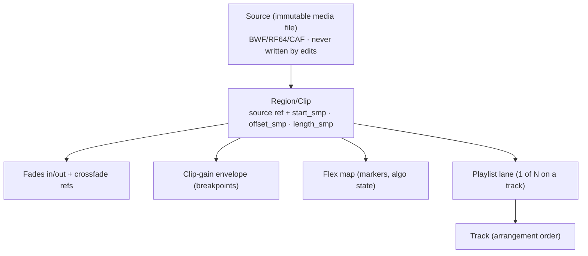

# S7-EDT/MID/AUT · Editing, Sequencing & Automation Engines

| | |
|---|---|
| **Status** | DRAFT FOR REVIEW |
| **Version** | 0.9 |
| **Date** | 2026-09-15 |
| **Owner** | Principal Audio SWE |
| **Fulfills** | Input Requirement 3 (Core Feature Set) |

---

# PART A — Sample-Accurate Editing (EDT)

## A1. Non-destructive data model (EDT-01)

- **All bounds are integer sample positions, tick view derived** (ARC-TIME). A region *never* stores musical bounds as truth.
- Edits = commands producing engine graph diffs (ARC-MDL); sources are reference-counted; "Consolidate/Bounce in place" creates a *new* source + swaps references; the old source is untouched.
- **Playlists (PT parity):** each track owns N lanes; one active. Lane ops: duplicate, previous/next + audition, "filter lanes" (rating while tracking), and **Quick-Swipe comping** across lanes into a Comp lane (Logic parity) — both gestures edit the same lane model, so PT and Logic muscle memory coexist on one structure.
- **Region grouping (EDT-04):** Pro Tools-style *clip groups* plain and simple: group membership badge on regions, group-follows-selection, edit ops apply to all members (respecting group suspend `⇧⌘G`, shared with mix groups, MIX-09). Groups are one construct for edit+mix, matching PT's behavior and remaining assignable per-attribute.

## A2. Sample-accurate operations (EDT-02)

| Operation | Spec |
|---|---|
| Separate/split | At any sample (playhead, marquee, in/out points); `B` in Precision keyboard focus |
| Trim / shuffle | Head/tail trim to the sample; Shuffle close-gap maintains phase relationships |
| Nudge | ±1 sample minimum; nudge ladder 1/10/100/1000 smp, ms, frames, grid; `⌥`-nudge = move *contents* within fixed bounds |
| Slip content | Move audio inside static region bounds, 1-sample steps, transient readout |
| Sync point | PT-style per-region sync point (displayed marker), used by Grid/Spot |
| Spot | Dialog spots by sample, timecode, or bar.beat.tick — all three shown sync'ed while typing |
| Strip silence | Threshold/attack/release/2-side pads → creates regions at sample bounds |
| Heal separation | Restores a prior split if bounds still contiguous (PT behavior) |
| Quantize audio | To grid via transient markers (uses Flex slicing map, non-destructive) |

**Acceptance (EDT-02A):** scripted edit battery on 1 kHz tone + click track: every resulting boundary lands within **0 samples** of target; bit-exact vs. reference renders.

## A3. Fades & micro-fades (EDT-03)

| Element | Spec |
|---|---|
| Region fades | In/out, 0…60 s, attached to region bounds, draggable from fade corner badges (UIW-06) |
| **Micro-fades** | Per *boundary* (between adjacent regions): 1–500 ms, default 10 ms, asymmetric allowed; auto-created by split/trim ops when enabled (pref: on) — the anti-click guarantee, Pro Tools "auto fades" semantics |
| Crossfades | On overlap (X-Fade drag mode) or explicit; equal-power default; shapes: linear, equal-power, S-curve, custom (drag curvature); *linked* (PT: fades move as one) or free in/out lengths |
| Batch fades | Dialog over multi-selection: lengths, shapes, pre/post-roll; "strip all fades" |
| Rendering | Fades render in-lane (RT or MAE); curve evaluation is per-sample; no breakpoint quantization coarser than 1 sample |
| Data | Fades are region data (travel with copy/import), not plug-ins; Logic fade import maps 1:1 (CMP-04) |

## A4. Clip gain (EDT-05)

- Per-region **clip-gain line with breakpoints**: range **−60…+24 dB, 0.1 dB steps**, rendered **pre-insert** (before plug-ins) and pre-fader by construction.
- Editing: pencil on the region (UIW-06), arrow-key ±0.5 dB on selection, breakpoints snap to samples and transients; marquee-raise/lower selection gesture (`⌥⇧`-drag) with live dB readout.
- Distinct from *region gain* (Logic single-value) — Logic import maps region gain → static clip-gain value, exported back as region gain if line is flat (fidelity rule CMP-04).
- **Clip Effects/Pitch v1.0 scope:** clip gain only; per-clip plugin racks are v1.1.

## A5. Flex Time & Flex Pitch (EDT-06/07)

| Subsystem | Spec |
|---|---|
| Detection | Dual-pass transient map (broadband + harmonic confidence), stored in `Analysis/` per source; manual transient editing with quantize/nudge; detection tolerance markers ≥ ±2 samples within defined window |
| Time algos | Slicing ✱zero-latency · Rhythmic · Monophonic · Polyphonic · Tempophone · Speed (varispeed formant-linked) — Logic-algo family with S7 DSP; quality targets: −60 dB THD+N at ±15% stretch (mono), artifact budget table per algo |
| Markers | Flex markers sample positions on the *warped* map; drag between transients; 3-marker lock semantics identical to Logic |
| Pitch | Per-note pitch/drift/vibrato/formant/gain overlay on monophonic sources; scale-quantize; "perfect pitch" presets; edits render through the region's Flex state, non-destructive |
| Integration | Flex state rides region (copy/paste/import preserved); MAE lane pre-renders warped stretches in 4096-spl blocks; RT-lane Flex live only for Slicing/Speed (others require parked or freeze—same compromise as Logic) |
| Handles | **Both UIs surface the same handles:** region-edge stretch handles + marker triangle handles; in Canvas they appear on ⌥-hover like Logic; in Precision via Flex view toggle (`⌃F`) like an Elastic-Audio lane |

## A6. Comping & Take Folders (EDT-08)

- Record-in-loop auto-creates **take lanes**: swipe across lanes to comp (Logic Quick Swipe) or promote segments via playlist lanes (PT) — identical underlying `comp_map` (list of (lane, start, end)), so either gesture edits the same data.
- Crossfades across comp cuts: auto 5 ms equal-power (pref), displayed as sewn seams; "Flatten" renders a new region, keeps lanes intact underneath.
- Take folder ↔ playlist export to Logic preserves folder structure (CMP-04).

---

# PART B — MIDI & Sequencing (MID)

## B1. Event & timing model (MID-01)

- Events stored as 64-bit **ticks (960 PPQ)** *and* pinned sample position; sample re-derivation on tempo edit per ARC-TIME.
- Types: note (pitch, vel, **release velocity**, off-tick, channel, articulation ID), CC (8-bit mode + **14-bit/32-bit hi-res** pairs), pitchbend 14-bit, channel & poly aftertouch, program+bank, SysEx blobs, **MPE per-note envelopes** (per-note channel data kept losslessly — Logic drops much of this; seven7 preserves it, CMP-04).
- Chase: on locate, engine rebuilds controller state ≤ 100 events back-search, incl. MPE; chase table unit-tested against reference maps.
- Input: timestamp to driver sample clock; ±1 sample alignment of armed MIDI→audio print tests (MID-01A); per-port delay trim ±50 ms; velocity curves per device.

## B2. Editors (MID-02)

- **Piano roll:** brush/line/eraser/velocity tools, unlimited overlaid CC lanes, note names/scale layers, time handles on selection edges (Logic), **per-note MPE curve overlays** (semitone/pressure/timbre), sample display option on the ruler; function transforms (humanize w/ seed, thin, fixed velocity, exponential scale).
- **Basic notation preview** (v1): single-staff render for printing chords/melodies; full score editor deferred (VSN scope).
- Drum mode: pad-name rows from kit map, GM defaults, custom maps saved with kit presets.

## B3. Step/Pattern Sequencer (MID-03) — Logic 12.3 tier

- Pattern regions on tracks (source of truth = pattern object, not rendered notes).
- Rows ≤ 32 per pattern: **note rows** and **automation rows**; steps up to 64; rate 1/4…1/64 + triplet/dotted; playback direction per row (fwd/rev/ping-pong/random); **length & offset per row** (polyrhythms).
- Per-step: velocity · gate % · tie · **ratchet 1–8** · skip/probability % · octave/legato · per-step CC value on automation rows (16 curve shapes).
- Edit gestures: live record-in (Logic "Pattern Recording"), step-paint, pattern rotate/invert/randomize (seeded), mono-note convert; **round-trip**: S7 exports pattern regions to Logic 12.x pattern objects (CMP-04) — degraded to MIDI clip only if target Logic version lacks pattern support, with report entry.
- **Live Loops grid:** cells (audio / MIDI / pattern-draggable), scenes with quantize-start (Off/Beat/Bar/Cell-end), simultaneous cell start/stop, performance recording into Arrangement as regions; classic Logic grid geometry (rows=tracks, columns=scenes) with PT-lane display in Precision mode.

## B4. Articulations (MID-04)

- Articulation sets per instrument track: ID list, output mapping (keyswitch/CC/program), per-articulation channel; articulation lane in editors; Logic `.plist` articulation sets import natively; articulations print on Logic export (CMP-04).

## B5. MIDI FX chain (MID-05)

Per instrument strip, **4 MIDI FX slots pre-instrument** (Logic signal-flow parity), plus post-instrument MIDI-thru tapping for FX that generate events:

| S7 device | Covers Logic | Notes |
|---|---|---|
| Arpeggiator | Arpeggiator | all orders, latch modes, octave ranges, rate incl. triplet/dotted; **sample-synced** to transport |
| Chord Trigger | Chord Trigger | single+multi, learn, strum ms |
| Modifier | Modifier | remap any event⇄any |
| Modulator | Modulator | LFO/env→CC, per-track tempo sync |
| Note Repeater | Note Repeater | repeats, gate, velocity ramp |
| Randomizer | Randomizer | seeded, per-param amount |
| Transposer | Transposer | scale-aware, root/scale |
| Velocity | Velocity Processor | curves, add/scale, limit, fix |

Plugin-added: **Humanize+** (timing/velocity/length, correlated-drift model), **Strum** (guitar spacing w/ chord-voicing awareness).
Automation: every MIDI-FX parameter is automatable like any plug-in; MIDI FX output events are timestamped sample-accurate (events carry sample offsets inside their block).

---

# PART C — Automation Engine (AUT)

## C1. The dual-mode contract (AUT-01)

> Requirement: *"Dual-mode automation system allowing region-based automation (Logic-style) and sample-accurate track automation (Pro Tools-style)."*

| | **Region automation** (Logic) | **Track automation** (PT) |
|---|---|---|
| Bound to | Region data — moves/copies/loops **with** the region | Absolute timeline — anchored to session, survives region moves |
| Curves | Logic point/segment model (incl. per-point curves) | Breakpoint lists, vector + stepped, curves between points |
| Use | Creative: filter sweeps inside a loop | Engineering: rides, ducking, QC'd masters |
| Storage | On region (travels to Logic lossless, CMP-04) | In per-track lanes per parameter |

Both systems may drive the **same parameter simultaneously**; evaluation order: `final(t) = track_lane(t) ⊕ region_curve(t − region.start)` where ⊕ = absolute-value override with region curve acting as **relative offset** when display is in track mode (Logic-compatible semantics), documented per-parameter class in the SDK.

**Conversion commands (AUT-06):** "Region ⭢ Track" / "Track ⭢ Region" preserving evaluated result bit-exactly (points sampled at event density, then re-thinned with the same tolerance — bounce-diff test: identical render).

## C2. Sample accuracy of playback (AUT-02)

- Breakpoints live at integer samples; playback evaluation emits **parameter events with sample offsets** to the engine (ARC-RT-03) at up to one event per sample for fader-critical params, default control period 32 samples.
- Fader/gain params apply a **5 ms dezipper ramp** in the engine; plugins receive both ramped gain (engine-side safety) and exact events.
- MAE lane offsets automation by `−L_ahead` with identical evaluation — sample-aligned to RT playback (verified by bounce-diff of armed vs parked bounces: bit-exact gain trajectories).

## C3. Write modes (AUT-04) — mixer + track header

`Off · Read · Touch · Latch · Trim (Touch/Latch variants) · Write(Overwrite, destructive-marked) · Preview`

| Mode | Behavior |
|---|---|
| Touch | writes while control held; returns to underlying lane on release at configurable glide (25–500 ms) |
| Latch | sticks after release until stop/punch-out |
| Trim | offsets existing curve by ±dB while held; writes delta on release; **works on VCA members as composed offsets** (MIX-09) |
| Preview | PT-style: audition moves without writing; **Punch capture** writes the previewed states on punch-in command; suspend/punch per parameter |
| Write Overwrite | clears lane over pass range, marked sessions warns & logs (post workflow parity) |
| Auto-match/glides, latch-prime in stop, write-to-current/-to-end/-to-punch/-to-all | full PT "Automation" window equivalence, dockable |

Suspend panel: per-lane global suspend (Vol/Pan/Mute/Send/Plugin) toggles — PT parity, plus region-automation master suspend.

## C4. Editing & thinning (AUT-05)

- Pencil/line/parabola/square/sine/triangle draw; marquee-move of point selections; edge-trim via smart tool; point nudge keys (1-sample steps).
- **Thinning:** real-time write thinning tolerance 0.5% (pref) with spline fit; deterministic post-thin ("Thin selection") target point count shown before apply; round-trip rule: exports write *evaluated* curves for systems without native curve segments.
- Copy/paste between lanes incl. **pan→send-level** conversions on paste (scale & law conversion documented); paste-special modes: repeat, fill-selection, as-trim.
- Automation **follows edit** options per-lane (PT "automation follows edit" + Logic "move automation with regions: Never/Always/Ask").

## C5. Display

- Lanes stack below regions (Precision) or overlay toggle `A` (Canvas); color per param class; points render ≥ 2 px at all zooms (no overdraw flicker); selected-param quick-switcher on header (⌃⌘←/→ cycles written lanes first).

---

## D. Requirements Index (this document)

| ID | Requirement | Acceptance |
|---|---|---|
| EDT-01 | Non-destructive model, integer-sample bounds | Property tests vs ARC-TIME; source-file hash unchanged across 10⁵ edit commands |
| EDT-02 | Sample-accurate op battery | EDT-02A: 0-sample tolerance vs reference renders |
| EDT-03 | Micro-fades at boundaries, fade set complete | Click-detector on split/trim battery: none above −60 dBFS |
| EDT-04 | Unified clip group + attributes | PT A/B gestures parity tests; group suspend respected by engine |
| EDT-05 | Clip gain −60…+24, pre-insert, breakpoints | Gain staging probe: measured application point before first insert |
| EDT-06/07 | Flex time/pitch with Logic-family algos | Artifact budget table met on conformance corpus; markers round-trip (CMP-04) |
| MID-01 | Hi-res MIDI + MPE preserved end-to-end | MPE loopback diff = lossless; armed-print alignment ±1 sample |
| MID-03 | Pattern seq + Live Loops at Logic 12.3 tier | Feature matrix pass (golden projects), incl. round-trip rules |
| MID-05 | 4-slot MIDI FX, automatable, sample-stamped | Event/jitter ≤ 1 sample @ 128-spl block |
| AUT-01/02 | Dual-mode automation, sample-accurate eval | Bounce-diff: armed vs parked vs converted = bit-exact |
| AUT-04 | PT write-mode set incl. Preview/Punch | Gesture→curve reference tests for all modes |
