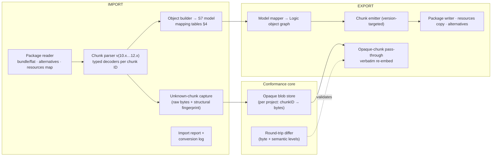

# S7-CMP · Logic Pro Compatibility Layer & Import/Export Strategy

| | |
|---|---|
| **Status** | DRAFT FOR REVIEW |
| **Version** | 0.9 |
| **Date** | 2026-09-15 |
| **Owner** | Principal Audio SWE (Formats) |
| **Fulfills** | Output Requirement 4 (Compatibility Strategy), Input Requirement 1 (Native Logic Compatibility) |

> **Engineering honesty clause.** `.logicx` is an Apple-proprietary, undocumented format. This document specifies a conformance-driven codec architecture whose contract is *measurable* (round-trip fidelity on an expanding golden corpus) rather than assumed from schema claims. Where byte layouts are version-dependent, the codec treats them as data to be preserved, not decoded.

---

## 1. Supported surface (CMP-01)

| Direction | Format | Versions |
|---|---|---|
| Import | `.logicx` (bundle & single-file package) | Logic Pro 10.4 → 12.x |
| Export | `.logicx` | target selectable: 12.x (default), 11.x, 10.7.x |
| Exchange presets | `.cst` channel-strip settings, `.aupreset`, EXS24 `.exs`, articulation `.plist` | as found on user systems |
| Secondary interchange | AAF (export, embedded or referenced audio, handles) for PT-side collaboration; BWF/RF64, MusicXML v1.1 |

---

## 2. Format anatomy (observed, versioned)

```text
Song.logicx/                       ← macOS package (or flat package file)
├── Alternatives/
│   └── 000/
│       ├── ProjectData            ← primary object graph (chunked binary container)
│       ├── MetaData / DisplayState (plist family)
│       └── Undo Data.nosync/
├── Resources/                     ← Smart Control art, impulse responses, …
├── Media/
│   ├── Audio Files/  Movie Files/ ← consolidated assets (or file refs when not)
└── (version-dependent aux payloads: pattern data, analysis caches…)
```

Facts the codec depends on (validated in CI against each supported version):
- The bundle root is stable across 10.x–12.x; **`ProjectData` is a versioned chunked container**; alternatives and display state are parallel peer structures.
- Audio/MIDI media may be *inside* the bundle (consolidated) or *referenced* by absolute path; both must round-trip as-is.

**Implication → architecture: ** the codec is organized as *package layer* (bundle semantics, alternatives, resources) + *chunk layer* (ProjectData parse/emit) + *object layer* (semantics). The object layer can never be forced to understand a chunk to preserve it.

---

## 3. Codec architecture (CMP-ARC)



### 3.1 The zero-loss guarantee (CMP-06) — how "no metadata loss" is engineered

1. **Rule 1 (Opaque retention).** Every chunk the object layer does not fully interpret is stored, byte-exact, in the project's opaque store (with its parent path + index inside the container). On export, unmodified chunks are re-emitted **verbatim from the store**, not re-encoded. ⇒ *Any data seven7 doesn't understand is definitionally preserved.*
2. **Rule 2 (Interpreted fidelity).** Chunks *are* interpreted only where the object mapping (§4) is total for the target version. Where a mapping is total, the chunk is re-encoded from the S7 model; where partial, the interpreted subset is patched into the retained bytes (byte-level field surgery, offsets locked by golden-file tests) and the remainder passes through.
3. **Rule 3 (Never degrade silently).** Every semantic approximation (e.g., a Logic-only plug-in with no AU present on the host) writes an entry to the Import/Export Report with: object, field, action taken, and original value (retrievable for restore on the next round-trip).
4. **Rule 4 (Version targeting).** Chunks whose layout changed between Logic versions are emitted per target version from version-locked encoders; the differ refuses to emit a chunk whose layout doesn't match the declared target (fails closed).

### 3.2 Lossless levels (what the differ measures)

| Level | Definition | Gate |
|---|---|---|
| L0 byte | Export → import by Logic (untouched) → export: ProjectData byte-domains equal except whitelisted volatile fields (timestamps, cache seeds) | CI must: 100% on golden corpus |
| L1 semantic | Object-graph JSON-ification equal after canonical sort (interpreted subset) | CI must: 100% |
| L2 audio | Bounce of imported project in seven7 vs bounce of source project on reference Logic install (perceptual + null-test where possible; published deltas) | weekly matrix |

---

## 4. Object mapping tables (CMP-04)

### 4.1 Project & tracks

| Logic entity | seven7 entity | Fidelity & rules |
|---|---|---|
| Project (tempo/meter/key sig maps, sample rate, bit depth) | S7 project + ARC-TIME maps | Total. Tempo segments reserialize exactly (integer rational both sides) |
| Track (audio) | S7 Audio track | Total, incl. disabled/muted states, icons, colors (S7 palette extends — Logic colors quantize on export, swatch param preserved in opaque metadata) |
| Track (software instrument) | S7 Instrument track | Total |
| **Track Stack — Folder** | S7 Folder Stack (MIX-02) | Total: membership, collapse state (visual), name |
| **Track Stack — Summing** | S7 Summing Stack = folder + auto-routed Aux (bus auto-named) | Total: sub-mix bus identity, sends into stack preserved; S7-native summing stack exports as Logic summing stack |
| Aux / Output / Master strips | Aux / Bus-Master / Master | Total (incl. serial numbering conventions Logic expects) |
| Alternatives | S7 Alternatives | Total (import active + N alternatives as snapshots; export writes all back) |
| Project notes / track notes | S7 notes | Total (UTF-8, no length games) |

### 4.2 Regions, fades, groups

| Logic entity | seven7 entity | Rules |
|---|---|---|
| Audio region (+anchor position) | Region (source ref, offset, bounds; sync point = anchor) | Total; bounds/anchor sample-exact both directions |
| Region gain (−30…+30) | Clip-gain static value (EDT-05) | Imports as flat line; exports back as region gain **iff** line remains flat, else as rendered clip gain — report entry (Rule 3) |
| Region fade in/out (value+curve) | Region fades (EDT-03) | Total (Logic curve params mapped 1:1); S7 crossfade extras → nearest Logic params on export, exact data retained in opaque store |
| Take folder (comps, swipes) | Playlist lanes + comp_map (EDT-08) | Total: comp selection map preserved segment-wise |
| Groups (Logic edit-group assign) | Unified groups (EDT-04/MIX-09) | Total for edit aspects; Logic has no mix-attributes — on export, edit membership preserved, mix attrs live in S7 opaque store |
| Markers / marker alternatives / arrangement markers | S7 markers (all three classes) | Total incl. marker sets |
| Cycle/locators, punch, metronome settings | Transport/prefs | Total |

### 4.3 Mixer, routing, automation

| Logic entity | seven7 entity | Rules |
|---|---|---|
| Channel-strip inserts (AU slots, bypass, order) | Inserts 1–8 (MIX-01) | Total; slots >8 impossible in Logic (S7 post slots 9–10 export as **inactive note** in strip metadata + opaque) |
| Sends (slot, dest bus, level, pre/post) | Sends 1–10 | Total; Logic bus numbering convention preserved on export (re-sequenced if S7 numbering sparse) |
| I/O (in/out paths, output offsets) | Strip I/O + matrix edges | Total |
| Pan/balance + surround panner values | Panner params | Total per width; immersive objects → Logic surround where possible, else ADM sidecar + report |
| **Region-based automation** | S7 region automation (AUT-01) | **Lossless by construction** (same model) |
| **Track-based automation** (Logic's "track automation") | S7 track lanes | Total; curve shapes exported as breakpoint vectors (Logic-compatible encoding), exact original retained |
| Solo/mute/record states, input monitoring | Mix/edit states | Total |

### 4.4 MIDI & patterns; Flex

| Logic entity | seven7 entity | Rules |
|---|---|---|
| MIDI region (notes/CC/pitchbend) | MIDI region (960 PPQ both) | Total incl. chase-sensitive controller data; MPE: S7 preserves per-note channels into Logic as channelized events (Logic's own encoding), no loss |
| Quantize/groove/velocity ops on region | Non-destructive MIDI transforms | Total (stored op params, not baked) |
| 12.x pattern regions / step rows | S7 pattern objects (MID-03) | Total for 12.x export; →MIDI clip for ≤10.7 targets (Rule 3 report) |
| Live Loops cells/scenes | S7 Live Loops grid | Total (cell types, scene settings); performance-recorded arrangement preserved |
| Articulation sets (track-level plist) | MID-04 sets | Total (`.plist` semantics identical) |
| Flex Time (algo, markers) | EDT-06 Flex map | Markers & algo ID total; S7-only algos degrade to nearest Logic algo + retained original (Rule 2/3) |
| Flex Pitch note edits | EDT-07 note overlay | Total (Note edits ser/deser matched on golden corpus) |

### 4.5 Plug-ins & presets (CMP-05)

| Logic data | seven7 handling | Fidelity |
|---|---|---|
| AU plug-in instances (type/subtype/manu + state) | S7 attempts to instantiate the **same AU** on macOS; state blob injected verbatim | **Bit-identical sound when AU present**; untouched blobs re-export verbatim even if session moved between hosts |
| AU absent on export host | Slot kept *inactive* (PT-style), state blob retained in `Plug-in States/` | Lossless placeholder; re-opening on Logic restores the live plug-in |
| `.cst` channel-strip settings | Import/export of full strips (inserts+sends+I/O+Smart Controls) | Total; S7 shows "band-age" warning if targeted Logic version predates a contained AU |
| `.aupreset` | Into unified preset DB, tagged by plug-in ID | Total (plist passthrough + index) |
| EXS24 `.exs` instruments | Parsed into **S7 Sampler** (zones/groups/loop/mod matrix); original `.exs` kept in Resources | Playable parity (published conformance notes); original file re-exports so Logic opens the native instrument |
| Smart Controls (layout + mappings + art) | S7 Macro Panel renders layout 1:1 (knob/slider/toggle types; images from Resources) | Layout & mappings total; custom art **always** copied & re-embedded |
| Library/media indexes (Apple Loops tags) | Browser index read; referenced loops resolvable | Read-only support v1.0 (write-back v1.1) |

---

## 5. Import pipeline (UX + behavior) (CMP-02)

1. **Detect & sniff:** package vs flat; Logic version from container header; unsupported/future version → opens *offline-preserve* mode (browse + re-export only, Rule 1 protects the file).
2. **Media resolution:** in-bundle first → referenced paths → system libraries → manual relink dialog (with search roots remembered per project). Missing media = offline regions (visual, phase-correct length) — never dropped.
3. **Object build:** mapping tables §4; per-object report rows where any Rule-2/3 action occurred.
4. **Audio sanity:** imported project bounces are checksummed per track vs Logic reference when available (L2 gate) during conformance runs; in-app, stems are validated for length/alignment.
5. **Report:** dockable panel, filterable by severity, **"copy as text"** for handoff; counts surfaced in the title bar during import ("imported with 0 warnings").

## 6. Export pipeline (CMP-03)

- Target version picker (12.x default) with capability pre-flight: features unavailable in target are listed *before* writing, one click to apply documented degradations or keep S7-native only (Rule 3 requires user-visible listing, never silent).
- Alternatives: writes all S7 alternatives to Logic alternatives (000 = active).
- Resources: Smart Control art, EXS originals, opaque store flush; consolidated-media option mirrors Logic's "save assets".
- **Determinism:** same model + same target ⇒ byte-stable output (whitelisted volatiles excluded) — required for CI diffs and VCS diff sanity.

## 7. Conformance program (CMP-08) — where this stops being a promise

| Asset | Content | Cadence |
|---|---|---|
| **Golden corpus** | ~200 projects × 3 versions (10.7/11.x/12.x): every object in §4 exercised, incl. adversarial: 10⁵-length fades, 400-segment tempo maps, nested stacks 4 deep, 200-plug-in strips, MPE stress, surround+immersive | CI gate on every codec change (L0/L1) |
| **Reference bounces** | Logic-rendered stems on a controlled Mac (versioned image) | Weekly L2 |
| **Fuzz farm** | Structure-aware mutational fuzzing of ProjectData/package readers (AFL++ harness, ARC-C13 isolation) | Nightly; crashers fixed before codec merges |
| **Interop lab** | Physical passing of projects between S7 and Logic installs incl. iCloud bundle edge cases | Per release |

**Release bar:** L0 100% on corpus, L2 deltas within published table, zero fuzz crashers open > P1.

---

## 8. Failure modes & guardrails (CMP-07)

| Scenario | Behavior |
|---|---|
| Corrupt bundle entry | Refuse destructive ops; offer repair-from-alternatives; never overwrite the source file in place (imports always copy-on-open for foreign formats) |
| Logic update ships new chunk layouts | Compatibility matrix flips to "preserve-only" for that version (Rule 1) until the encoder for it ships — *opening is always safe*, semantics catch up asynchronously |
| User edits in Logic a file S7 exported | Re-import path treats it as fresh import; opaque store rebuilds; diffs surface in report |
| Cross-host round trip (S7 mac ⇄ S7 win) | AU state blobs retained so mac-side Logic still restores; S7-native substitutes carry the stock-suite mapping (MIX-12) |

---

## 9. Requirements Index (this document)

| ID | Requirement | Acceptance |
|---|---|---|
| CMP-01 | `.logicx` 10.4→12.x in / 10.7→12.x out | Matrix pass on golden corpus, all versions |
| CMP-04 | Object mappings §4 total except declared degradations | L1 semantic diff clean on every mapped family |
| CMP-05 | AU/preset/EXS/SmartControls per §4.5 | Presence/absence scenarios both restore exactly |
| CMP-06 | Zero-loss via opaque retention (Rules 1–4) | L0 byte-gate 100%; store size audited (no unbounded growth) |
| CMP-07 | Guardrail behaviors §8 | Sabotage-suite: 0 source-file destructive writes in 10⁴ adversarial opens |
| CMP-08 | Conformance program operational | CI + nightly + weekly dashboards green at release bar |
